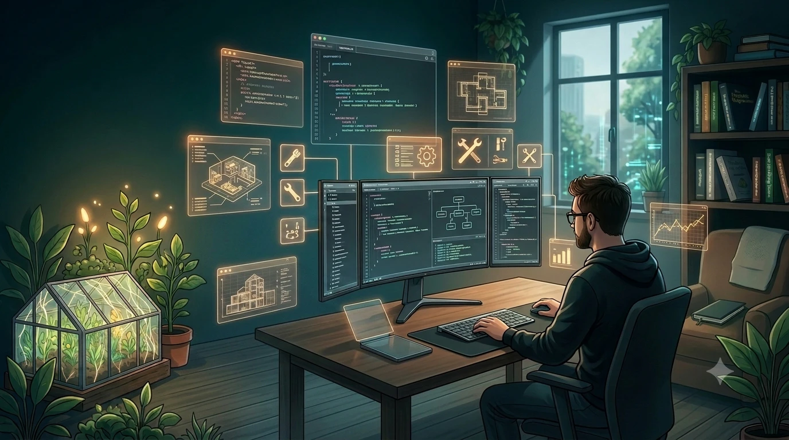

---
title: "Обо мне"
date: 2026-07-13
tags: [цифровой сад, devops, ai, workflow]
layout: page
menu:
    main:
        weight: -60
        params:
            icon: user

------

Привет, меня зовут Артём.

Добро пожаловать в мой цифровой сад и мастерскую.

Здесь я собираю то, что действительно работает: проверенные решения, полезные инструменты и мысли, которые помогают лучше понимать и структурировать мир вокруг.

Пишу о:

- **DevOps и инфраструктуре** — автоматизация, Linux, сети, удобный и надёжный workflow.
- **Работе с изображениями и ИИ** — практические пайплайны, эффективные промпты, связка классических редакторов с генеративными моделями.
- **Книгах и рефлексии** — заметки о прочитанном и о том, как хорошие тексты помогают лучше думать.

Никакого пафоса. Только честные наблюдения, рабочий код и аккуратные решения.

Весь исходный код сайта и мои конфиги — на [GitHub](https://github.com/The-Old-Cat).

Рад видеть тебя здесь.
