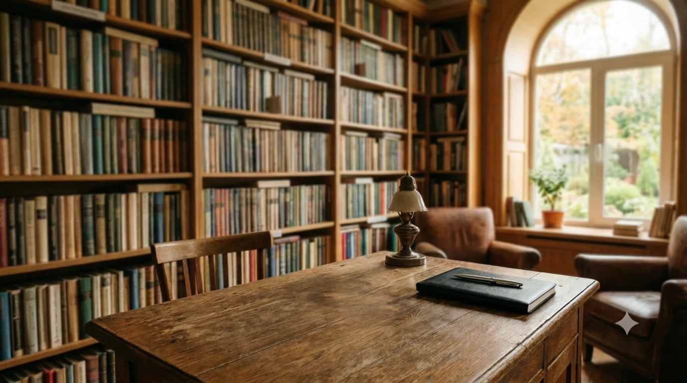
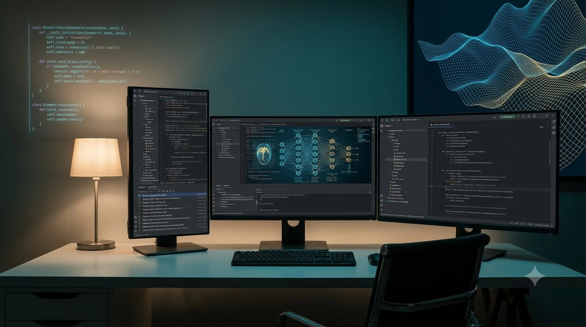
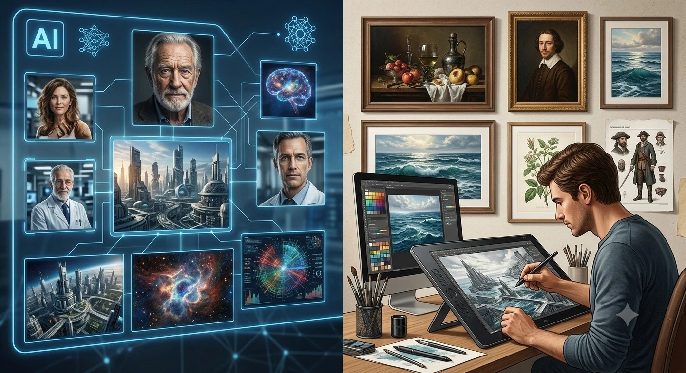

## Галерея

Здесь собраны мои визуальные работы: изображения, сгенерированные нейросетями, и картины, созданные вручную в графических редакторах.

### Создано с помощью ИИ

  

   

### Создано вручную

>**Примечание:**
>
>Со временем здесь будет больше работ. Я стараюсь сочетать возможности современных нейросетей с классическими графическими инструментами.
